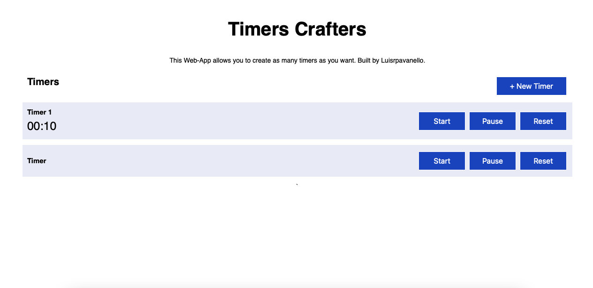

# Timers Crafters Application

Welcome to the Timers Crafters Application! This project allows users to set and manage multiple timers simultaneously. Each timer runs independently and displays the remaining time. The project is built using HTML, CSS, and JavaScript, and it leverages the `setInterval()` function to manage timer countdowns. In this README, we'll provide an overview of the project and guide you on how to use and customize it.

## Table of Contents

- [Preview](#preview)
- [Features](#features)
- [Getting Started](#getting-started)
  - [Prerequisites](#prerequisites)
  - [Installation](#installation)
- [Usage](#usage)
  - [Adding Timers](#adding-timers)
  - [Managing Timers](#managing-timers)
- [Learning Outcomes](#learning-outcomes)
- [Contributing](#contributing)
- [License](#license)

## Preview



Before diving into the details, you can check out a live demo of the Multi-Timer Application here: [Demo Link](https://htmlpreview.github.io/?https://github.com/luisrpavanelli/Timers-Crafters/blob/main/index.html)

## Features

- **Multiple Timers**: Create and manage multiple timers, each running independently.

- **Timer Properties**: Each timer object includes essential properties such as current time remaining, original time set, and the current timer state (running or paused).

- **Intuitive User Interface**: The application provides an easy-to-use interface for adding, starting, pausing, and resetting timers.

- **Customizable Styling**: You can customize the appearance of the timers using the included CSS styles or by modifying the CSS to fit your project's design.

## Getting Started

### Prerequisites

Before you begin, make sure you have the following prerequisites:

- A modern web browser (e.g., Chrome, Firefox, Safari)
- A text editor for code customization (e.g., Visual Studio Code, Sublime Text)

### Installation

Follow these steps to set up the Multi-Timer Application on your local machine:

1. Clone the repository to your local machine:

   ```bash
   git clone <repository-url>
   ```

2. Navigate to the project directory:

   ```bash
   cd multi-timer-app
   ```

3. Open the `index.html` file in your preferred web browser to launch the application.

## Usage

### Adding Timers

1. Open the Multi-Timer Application in your web browser.

2. Click the "Add Timer" button to create a new timer.

3. Set the timer's duration in hours, minutes, and seconds.

4. Click the "Start" button to start the timer countdown.

### Managing Timers

- **Start**: Click the "Start" button to start the timer to running time.
- **Pause**: Click the "Pause" button to pause the timer to running time.
- **Reset**: Click the "Reset" button to reset a timer to its original duration.

## Learning Outcomes

By working with this project, you will gain the following skills and knowledge:

- **Object Manipulation**: Learn how to create and manipulate JavaScript objects to store and manage timer data.

- **DOM Manipulation**: Understand how to interact with the Document Object Model (DOM) to display timer information on the web page.

- **Anonymous Functions**: Learn how to use anonymous functions to encapsulate functionality and make your code more modular.

- **Math Module**: Utilize the Math module to perform calculations, such as formatting numbers and converting between time units.

## Contributing

Contributions to this project are welcome! If you have any suggestions, bug reports, or feature requests, please [create an issue](#) or submit a pull request.

## License

This project is licensed under the MIT License - see the [LICENSE](LICENSE) file for details.